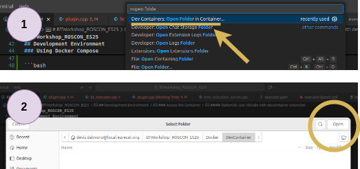

# BTWorkshop_ROSCON_ES25

BT4.x, Groot2, BTROS2: orquestación avanzada en ROS2

This repository contains BT.CPP assets to set up the simulation environment and tools stack for the workshop on advanced orchestration in ROS2, integrating BT.CPP 4.x, Groot2, BT.ROS2 for robotics behavior modular and composable orchestration.

## Overview

The stack combines:
- **BehaviorTree.CPP 4.x**: Core BT engine for ROS2
- **Groot2**: Visual editor and monitor for BTs
- **BT.ROS2**: ROS2 integration for BT prototipation and execution

## Build Setup

### Prerequisites

- Docker with Compose support
- Git
- X11 for GUI applications (Groot2, etc.)

### Building the Container

Use the provided build script to create the development environment:

```bash
cd Docker
./build_container.sh [OPTIONS]
```

#### Build Options

- **[Option A]** No arguments: Pull image from [dockerhub](https://hub.docker.com/r/deviseut/btroscon_es) (suggested!!!)
- **[Option B]** `--clean-rebuild`: Force a complete rebuild of the container, removing cached layers

With **[Option B]**
The build process will:
1. **Base Image**: Use the latest `pyrobosim_ros:${ROS_DISTRO}` as the foundation
2. **Dependency Management**: Import and update dependencies in `deps/` using VCS
3. **ROS2 Setup**: Install dependencies via rosdep and build the workspace
4. **Environment**: Prepare a full ROS2 workspace with all integrated BT components

## Development Environment

### Using Docker Compose

Launch the development container:

```bash
cd Docker
docker compose -f dev-docker-compose.yaml  up [--force-recreate]
```

This starts the main container with:
- **Network**: Host mode for ROS2 communication
- **Display**: X11 forwarding for GUI applications (Groot2)
- **Volumes**: Workspace and world files persistence

### Access the Container

#### Option(A): Use VSCode with devcontainer extension



Open the project in VSCode with the [Dev Container extension](https://marketplace.visualstudio.com/items?itemName=ms-vscode-remote.remote-containers) installed:

1. ctrl+shift+p -> "Dev Containers -> Open Folder in Container..."
2. Select folder `Docker/DevContainer`


#### Option(B): Use your custom editor and access the container through CLI
Connect to the running container:

```bash
docker exec --user btdev -it <container-name> bash
```

Inspect container-name with `docker ps -a`

The workspace is pre-built and sourced automatically.

## Quick Start

### 0. Health check of the environment
Once inside the development environment, quickly test the following cmds:

```bash
# Check your user 
whoami 
# btdev

# Check ros distro and ros_domain_id
env | grep ROS_D 
# ROS_DOMAIN_ID=12
# ROS_DISTRO=jazzy

# Check you are in the correct workspace
echo $PWD
# /roscon25_ws

# Compile and source
colcon build --symlink-install && source install/setup.bash
# Summary: 9 packages finished [...s]

#Check presence of this pkg
ros2 pkg list | grep behaviortree_pyrobosim
# behaviortree_pyrobosim
```

### 1. Launch simulator and Groot2

**Before** launching any graphical application, on a terminal on **your host machine** (not in your container!!!) give once the following command

```bash
xhost +local:docker
```

Let's go back to the container now....

To start the simulator:

```bash
ros2 launch simple_pyrobosim_ros demo.launch.py world_file:=/roscon25_ws/worlds/world12.yaml
```

`world_file` can have the following values:
- /roscon25_ws/worlds/world12.yaml for Exercise 1 and Exercise 2
- /roscon25_ws/worlds/world3.yaml for Exercise 3
- /roscon25_ws/worlds/world4.yaml for Exercise 4 


To install Groot2 (it is a simple GUI installation):
```bash
cd /roscon25_ws
chmod +x Groot2-v1.6.1-linux-installer.run && ./Groot2-v1.6.1-linux-installer.run
```
Follow gui installation and then create an alias (suggested, not mandatory).
You can put the alias directly in the .bashrc to easily start it from a new terminal.
```bash
# default <groot2-bin-exec-path> might be "/home/btdev/Groot2/bin/groot2"
alias groot2=<groot2-bin-exec-path> 
groot2 #should start groot2

# to "save" the alias in the user bash session
echo "alias groot2=/home/btdev/Groot2/bin/groot2" >> /home/btdev/.bashrc 
source /home/btdev/.bashrc
groot2 #should start groot2
```

### 2. Launch BTROS2 Executor and trigger a tree execution

Start BTROS2 Executor through:
```bash
ros2 launch behaviortree_pyrobosim executor.launch.xml
```

In another terminal, now you should be able to call:
```bash
ros2 action send_goal /pyrobosim_bt_action_server btcpp_ros2_interfaces/action/ExecuteTree "{target_tree: '<your-tree-name>'}"
```

You can replace `<your-tree-name>` with `Exercise0` to test it out.
Please note that the simulator must be started, otherwise the tree will take more time to load (ros2 srv and action will not be found and clients in the tree will timed out).

Pro tip:
You can open groot2 in monitor and check out the tree execution real-time by clicking on "Connect".